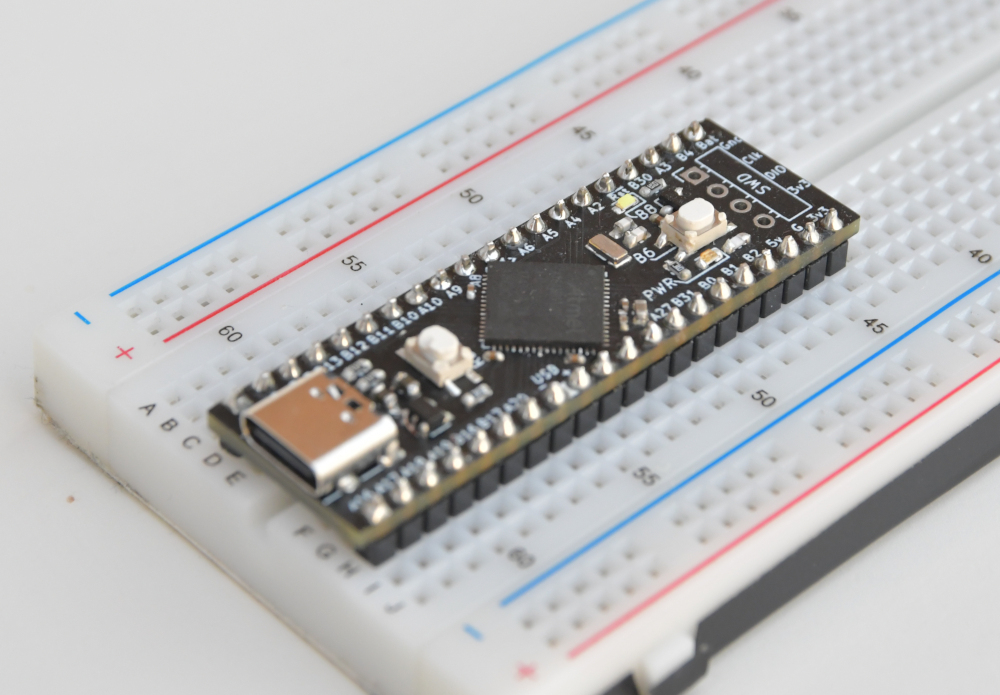
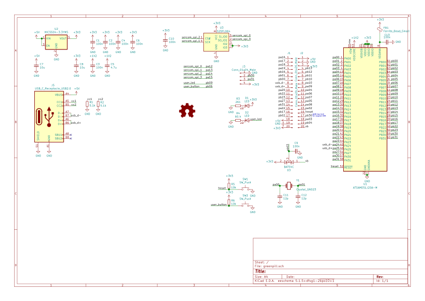

Greenpill
===
*Breadboard-able SAMD51 development board*

Inspired by the popular low-cost "Bluepill" and "Blackpill" STM32 boards, Greenpill aims to maintain some compatibility with those designs while adding features from the SAMD5x platform. Greenpill is designed to be used with [CircuitPython], although a SAMD51 port of Arduino could also be used.

## Features
 - SAMD51J20A-M microcontroller
   - Arm Cortex-M4 @ 120 MHz
   - 8 USB endpoints &ndash; enough for CDC & MSC (for CircuitPython), and some extras (eg. AUDIO)
 - Reversible USB Type-C connector supporting USB 2.0 data rates
 - On-board user LED and button
 - External 32.768 kHz crystal oscillator for RTC + clock source.
 - Up to 13 PWM-capable pins usable **simultaneously**
 - SPI flash footprint on underside - no pin conflicts with broken out pins (uses **SERCOM2**).

## Flashing CircuitPython
1. **TODO: add UF2 bootloader instructions**
2. [Build CircuitPython][BuildCPy] from [the fork][CPyFork]. Use the `atsamd` port and `BOARD=greenpill`.
3. Enter the UF2 bootloader by double-tapping the RESET button on Greenpill
4. You should now have a removable storage device called `CPYBOOT`. Copy `PATHTOUF2` to the root directory of this device. Once it has finished copying, `CPYBOOT` will disappear and `GREENPILL` will appear. You have now installed CircuitPython.

## Pin assignment
Pins are numbered **counter-clockwise** starting at the top-left pin (to the left of the USB-C connector).

| Greenpill Pin | GPIO name  | Available SERCOMs*               | Available PWM timers*                 | Comment                        |
|---------------|------------|----------------------------------|---------------------------------------|--------------------------------|
| User LED      | PB09       | -                                | TC4/WO[1]                             |                                |
| User Button   | PB06       | -                                | -                                     | Externally pulled up to 3v3    |
| VBat sense    | PB03       | -                                | -                                     | Connected to VBat via diode D3 |
| 1             | PA16       | SERCOM1/PAD[0] SERCOM3/PAD[1] | TCC1/WO[0] TCC0/WO[4]              |                                |
| 2             | PA17       | SERCOM1/PAD[1] SERCOM3/PAD[0] | TC2/WO[1] TCC1/WO[1] TCC0/WO[5] |                                |
| 3             | PA18       | SERCOM1/PAD[2] SERCOM3/PAD[2] | TCC1/WO[2] TCC0/WO[6]              |                                |
| 4             | PA19       | SERCOM1/PAD[3] SERCOM3/PAD[3] | TC3/WO[1] TCC1/WO[3] TCC0/WO[7] |                                |
| 5             | PB16       | SERCOM5/PAD[0]                   | TCC3/WO[0] TCC0/WO[4]              |                                |
| 6             | PB01       | SERCOM5/PAD[3]                   | TC7/WO[1]                             |                                |
| 7             | PB00       | SERCOM5/PAD[2]                   | -                                     |                                |
| 8             | PA24       |                                  |                                       | USB D-                         |
| 9             | PA25       |                                  |                                       | USB D+                         |
| 10            | PA20       | SERCOM5/PAD[2] SERCOM3/PAD[2] | TCC1/WO[4] TCC0/WO[0] -            |                                |
| 11            | PB22       | SERCOM1/PAD[2] SERCOM5/PAD[2] |                                       |                                |
| 12            | PB23       | SERCOM1/PAD[3] SERCOM5/PAD[3] | TC7/WO[1]                             |                                |
| 13            | PA27       | -                                | -                                     |                                |
| 14            | PB31       | SERCOM5/PAD[0]                   | TC0/WO[1] TCC4/WO[1] TCC0/WO[7] |                                |
| 15            | PA22       | SERCOM3/PAD[0] SERCOM5/PAD[1] | TCC1/WO[6] TCC0/WO[2]              |                                |
| 16            | PB17       | SERCOM5/PAD[1]                   | TC6/WO[1] TCC3/WO[1] TCC0/WO[5] |                                |
| 17            | PB02       | SERCOM5/PAD[0]                   | TCC2/WO[2]                            |                                |
| 18            | **5V**     |                                  |                                       |                                |
| 19            | **Ground** |                                  |                                       |                                |
| 20            | **3.3V**   |                                  |                                       |                                |
| 21            | VBat       |                                  |                                       |                                |
| 22            | PB04       | -                                | -                                     |                                |
| 23            | PA03       | -                                | -                                     |                                |
| 24            | PB30       | SERCOM5/PAD[1]                   | TCC4/WO[0] TCC0/WO[6]              |                                |
| 25            | ¬Reset     |                                  |                                       |                                |
| 26            | PA02       | -                                | -                                     |                                |
| 27            | PA08       | SERCOM4/PAD[0]                   | -                                     |                                |
| 28            | PA05       | SERCOM0/PAD[1]                   | TC0/WO[1]                             |                                |
| 29            | PA07       | SERCOM0/PAD[3]                   | TC1/WO[1]                             |                                |
| 30            | PA06       | SERCOM0/PAD[2]                   | -                                     |                                |
| 31            | PA04       | SERCOM0/PAD[0]                   | -                                     |                                |
| 32            | PA09       | SERCOM0/PAD[1]                   | TC0/WO[1] TCC0/WO[1] TCC1/WO[5] |                                |
| 33            | PA10       | SERCOM0/PAD[2]                   | TCC0/WO[2] TCC1/WO[6]              |                                |
| 34            | PB10       | SERCOM4/PAD[2]                   | TCC0/WO[4] TCC1/WO[0]              |                                |
| 35            | PB11       | SERCOM4/PAD[3]                   | TC5/WO[1] TCC0/WO[5] TCC1/WO[1] |                                |
| 36            | PB12       | SERCOM4/PAD[0]                   | TCC3/WO[0] TCC0/WO[0]              |                                |
| 37            | PB13       | SERCOM4/PAD[1]                   | TC4/WO[1] TCC3/WO[1] TCC0/WO[1] |                                |
| 38            | **3.3V**   |                                  |                                       |                                |
| 39            | **Ground** |                                  |                                       |                                |
| 40            | **5V**     |                                  |                                       |                                |

\* SERCOM2 and all TC*n*/WO[0] have been removed from this table. SERCOM2 is used by the SPI flash, and TC*n*/WO[0] timers are not usable for PWM output by CircuitPython. For a full reference of pin capability, see Table 6-1 in the [SAM D5x datasheet][samd5xdata]

## License
The contents of this repository, which include the Greenpill hardware, documentation, and design files, are released under the **Solderpad 2.1 license**. The recommended firmware for GreenPill (CircuitPython) is NOT part of this repository. Both [Adafruit/CircuitPython][CircuitPython] and the [fork][CPyFork] that provides Greenpill compatibility are released under the **MIT License** 

[CircuitPython]: https://github.com/Adafruit/CircuitPython "Adafruit/CircuitPython on GitHub"
[CPyFork]: https://github.com/Stary2001/circuitpython/tree/greenpill "Branch 'greenpill' from Stary2001/CircuitPython on GitHub; forked from Adafruit"
[BuildCPy]: https://learn.adafruit.com/building-circuitpython?view=all "Building CircuitPython | Adafruit Learning System"
[samd5xdata]: https://ww1.microchip.com/downloads/en/DeviceDoc/SAM_D5xE5x_Family_Data_Sheet_DS60001507F.pdf "SAM D5x/E5x Family Data Sheet | Microchip (PDF)"
